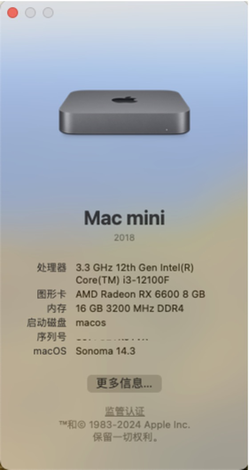
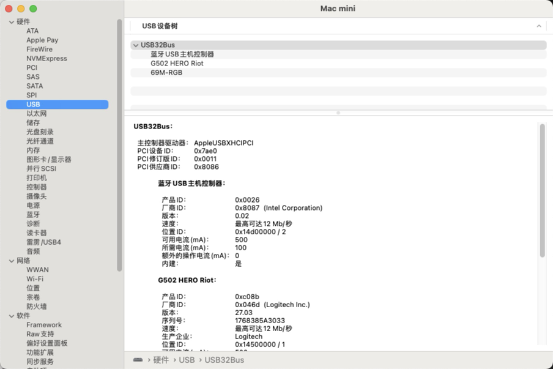
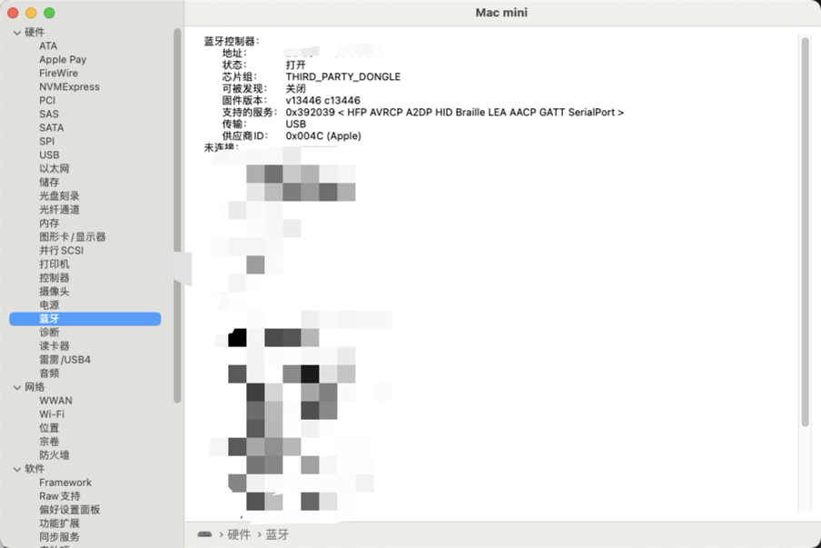

# Hackintosh EFI for MAXSUN H610itx with i3-12100F RX6600xt and Intel AX201 NIC

***Almost perfect.***
***Please generate new serial numbers.***

---

#### Basic info: 
- Opencore 0.9.6(7)
- Mac mini, 8
- MacOS 14.3 Sonoma
- With Windows boot in one disk

---
#### Hardware
 |                                              |
 |:------------------:|:-----------------------:|
 | **CPU**            | Intel i3 12100F         |
 | **Mother board**   | Maxsun H610itx          |
 | **GPU**            | AMD RX 6600             |
 | **Memory**         | Glory '天策' 3200MHz 8G*2 |
 | **SSD**            | Samsung SSD 970 EVO     |
 | **WiFi/Bluetooth** | Intel AX201             |

---

#### Works:

- [x] Audio
- [x] USB
- [x] WiFi
- [x] Bluetooth
- [x] CPU w/ Boost
- [x] GPU
- [x] LAN
- [x] Sleep and wake up
- [ ] Unstable AirDrop
- [ ] Sidecar

----

#### Some screenshots:

